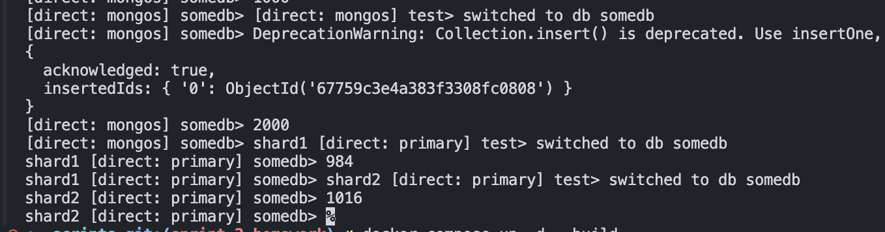

# pymongo-api

## Как запустить

Запускаем докер контейнер

```shell
docker compose up -d --build
```

Заполняем данными и в консоли сразу можно отследить работоспособность
не пугайтесь, там есть пауза между скриптами инициализаци и добавления, чтобы в консоли не было ошибок из-за недоступности какого-то инстанса

```shell
./scripts/mongo-init.sh
```

## Как проверить

### Если вы запускаете проект на локальной машине

Откройте в браузере http://localhost:8080

или посмотреть в консоли
(автоматизирован вывод количества документов на шардах и в общем)


